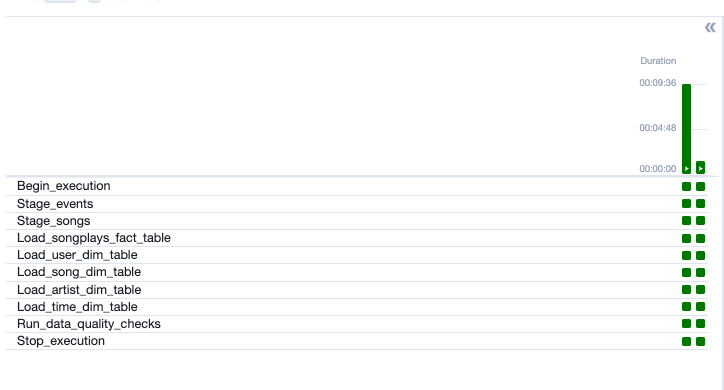

<body>
<h1>Data Pipelines with Apache Airflow</h1>

<h2>The ETL DAG</h2>

The ETL DAG is composed of the following tasks:

<ul>
    <li><strong>Begin_execution:</strong> Initialize the pipeline.</li>
    <li><strong>Staging tasks:</strong> Copy data from S3 to staging tables in Redshift. <em>Stage_songs</em> and <em>Stage_events</em> tasks are run in parallel.</li>
    <li><strong>Load fact table task:</strong> Load the songplays fact table in Redshift.</li>
    <li><strong>Load dimension tables tasks:</strong> Load dimension tables in Redshift. <em>Load_user_dim_table</em>, <em>Load_artist_dim_table</em>, <em>Load_song_dim_table</em>, and <em>Load_time_dim_table</em> tasks are run in parallel.</li>
    <li><strong>Run data quality checks task:</strong> Run checks to ensure data quality.</li>
    <li><strong>Stop execution:</strong> Mark the end of the pipeline.</li>
</ul>
 

<h2>Project Structure</h2>
<pre>
├── LICENSE
├── README.md 
├── create_tables.sql
├── assets
│   ├── screenshots
├── dags
│   ├── main.py
├── docker-compose.yaml
└── plugins
    ├── __init__.py
    ├── data_to_s3.py
    ├── helpers
    │   ├── __init__.py
    │   └── sql_queries.py
    └── operators
        ├── __init__.py
        ├── data_quality.py
        ├── load_dimension.py
        ├── load_fact.py
        └── stage_redshift.py
</pre>

<h3>docker-compose.yaml</h3>

Runs Airflow locally using Docker.

<h3>create_tables.sql</h3>

SQL script that can be used to create all the required tables in Redshift.

<h3>The dags/ directory</h3>
<ul>
    <li><strong>main.py:</strong> This is the main DAG where all the steps of the ETL are performed.</li>
    <li><strong>create_tables_dag.py:</strong> A helper DAG that can be used to create all the tables. Alternatively, one can run the script <em>create_tables.sql</em> in the Redshift cluster to set all the tables.</li>
</ul>

<h3>The plugins/ directory</h3>

This directory contains the <em>operators</em> and <em>helpers</em> subdirectories and the python script to download the data to our bucket.

<h4>data_to_s3.py</h4>

Python script that can be used to download the data from the Udacity's bucket to our bucket 

<h4>plugins/operators</h4>

Subpackage in which the reusable custom operators are defined.

<ul>
    <li><strong>stage_redshift.py:</strong> Defines the operator <em>StageToRedshiftOperator</em> that is used to copy data from a S3 path to staging tables in Redshift.</li>
    <li><strong>load_fact.py:</strong> Defines the operator <em>LoadFactOperator</em> that is used to load the fact table songplays using the staging tables.</li>
    <li><strong>load_dimension.py:</strong> Defines the operator <em>LoadDimensionOperator</em> that is used to load the dimension tables songs, artists, users, and time.</li>
    <li><strong>data_quality.py:</strong> Defines the operator <em>DataQualityOperator</em> that is used to run data quality checks at the last step of the ETL.</li>
</ul>

<h4>plugins/helpers</h4>

<em>sql_queries.py</em>: Defines the insert queries and the create table queries that are used by the <em>LoadDimensionOperator</em> and the <em>CreateTableOperator</em>, respectively.

<h2>Running the Project</h2>

To run the project, ensure you have an AWS account, Docker, and Docker Compose installed. Then:

<ul>
    <li>Set up an IAM user and a Redshift cluster in AWS.</li>
    <li>Run <code>docker-compose up -d</code> in the project root directory.</li>
    <li>Access the Airflow UI at <a href="http://localhost:8080">http://localhost:8080</a> (username: airflow, password: airflow).</li>
    <li>Configure connections in Airflow for AWS (aws_credentials) and Redshift (redshift).</li>
    <li>Trigger the <em>final_project</em> DAG from the Airflow UI.</li>
</ul>

<h3>Run the DAG</h3>

Click on the <em>final_project</em> and then trigger the DAG by clicking on the play button.

The whole pipeline should take less than 5 minutes to complete.

Before Running the Dag

DAG Running

DAG Success!

</body>
</html>
